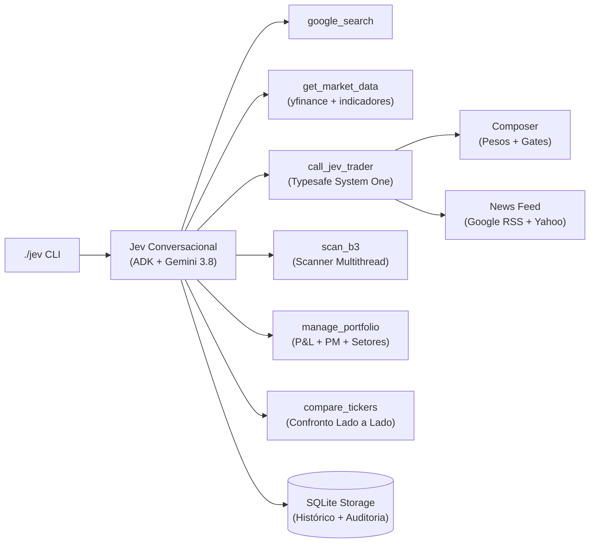

# 🗺️ Jev — Roadmap de Features & Próximos Passos

> Plano estratégico de evolução e backlog de desenvolvimento do Jev (ADK Gemini 3.8 Flash × Typesafe).
> Última atualização: 26/09/2026.

---

## 📍 Estado Atual das Entregas

| Capacidade | Status | Detalhes da Implementação |
|---|---|---|
| Análise de ativo único | ✅ **Entregue** | System One com 9 perguntas paralelas e gates de segurança |
| Fundamentos reais | ✅ **Entregue** | P/L, P/VP, ROE, DY, Dívida/PL, Margem Líquida via yfinance |
| Feed de notícias | ✅ **Entregue** | RSS Google News (pt-BR) + Yahoo News com cache in-memory |
| Indicadores técnicos | ✅ **Entregue** | MACD, Bollinger Bands, Volume Relativo, ATR, Suporte/Resistência |
| Testes do composer | ✅ **Entregue** | 10 testes de invariância, gates e calibração por horizonte |
| Scanner B3 multithread | ✅ **Entregue** | Pré-filtro paralelo com ThreadPoolExecutor (~3s para 85 ativos) |
| Gestão de carteira | ✅ **Entregue** | Compras/vendas, preço médio (PM), P&L realizado/não realizado |
| Consciência de carteira | ✅ **Entregue** | State reconhece posição ativa e avalia risco de concentração |
| Memória persistente | ✅ **Entregue** | SQLite local (`jev_memory.db`) para chat, prefs e auditoria |
| Comparador de ativos | ✅ **Entregue** | Confronto de 2 a 4 papéis com veredito de risco/retorno |
| Alertas / Monitoramento | ⏳ **Próximo Passo (Q4 2026)** | Daemon watcher de stops, alvos e mudança de recomendação |
| Dashboard Web | ⏳ **Próximo Passo (Q1 2027)** | Interface visual em Vite + React com charts e radar |
| Backtesting Engine | ⏳ **Próximo Passo (Q1 2027)** | Simulação histórica de recomendações vs benchmark IBOV |
| Multi-Mercado | ⏳ **Próximo Passo (Q2 2027)** | Suporte a papéis da NYSE e NASDAQ |
| Multi-Agent ADK | ⏳ **Próximo Passo (Q2 2027)** | Especialistas dedicados (Técnico, Sentimento, Risco) |

---

## 🎯 Backlog Priorizado de Próximos Passos

### 1. 🔔 Alertas e Monitoramento Contínuo (v0.4 — Prioridade Imediata)
**Impacto: 🟡 Alto** · Esforço: Médio · **Alvo: Q4 2026**
* **Objetivo:** Permitir que o investidor programe gatilhos de preço, stop-loss e mudança de score técnico.
* **Comandos Planejados:**
  * `"Me avise se PETR4 cair abaixo de R$ 45,00"`
  * `"Avise quando o RSI de VALE3 cruzar acima de 30"`
  * `"Monitore ITUB4 e avise se a recomendação virar COMPRA"`
* **Arquitetura:**
  * Arquivo de persistência `data/alerts.json` ou tabela `alerts` no SQLite.
  * Daemon de background executável via CLI (`./jev --watch` ou cron job).
  * Notificações nativas no macOS via `osascript / terminal-notifier` e webhook Telegram.

### 2. 🖥️ Dashboard Web Interativo (v1.0 — Q1 2027)
**Impacto: 🔴 Crítico** · Esforço: Alto · **Alvo: Jan-Fev 2027**
* **Objetivo:** Uma interface gráfica executiva e responsiva complementando o terminal.
* **Componentes:**
  * **Radar Heatmap B3:** Matriz visual do IBOV colorida por recomendação (Verde=Compra, Amarelo=Hold, Vermelho=Venda).
  * **TradingView Lightweight Charts:** Velas intraday/diárias com sobreposição de médias móveis e Bandas de Bollinger.
  * **Painel da Carteira:** Gráficos de alocação setorial em donut e evolução patrimonial.
  * **Chat Integrado:** Web UI do Jev com streaming de respostas e renderização de tabelas e badges.
* **Stack:** Vite + React + TailwindCSS + FastAPI backend.

### 3. 📉 Backtesting & Analytics Engine (Q1 2027)
**Impacto: 🟡 Alto** · Esforço: Alto · **Alvo: Fev-Mar 2027**
* **Objetivo:** Auditar e comprovar matematicamente a rentabilidade do modelo analítico do Jev.
* **Métricas:**
  * Alpha sobre o IBOV, Taxa de Acerto (Win Rate %), Profit Factor e Max Drawdown (MDD).
  * Simulação histórica das recomendações armazenadas em `recommendation_history` no SQLite contra preços reais de mercado a D+1, D+5, D+20 e D+60.

### 4. 🌍 Multi-Mercado: NYSE & NASDAQ (Q2 2027)
**Impacto: 🟢 Médio** · Esforço: Médio · **Alvo: Mar-Abr 2027**
* **Objetivo:** Suportar ativos globais sem limitação ao sufixo `.SA`.
* **Ajustes:**
  * `universe.py`: Adição dos universos S&P 500 (`sp500`) e Nasdaq 100 (`nasdaq`).
  * `market_data.py`: Identificação automática de praça e suporte a conversão de moedas (BRL/USD).
  * Normalização cambial na carteira pessoal.

### 5. 🤖 Multi-Agent ADK Especialistas (Q2 2027)
**Impacto: 🟢 Médio** · Esforço: Alto · **Alvo: Abr-Mai 2027**
* **Objetivo:** Dividir o agente conversacional em sub-agentes especialistas cooperativos sob o ADK:
  * **Agente Técnico:** Dedicado exclusivamente a price action, padrões de candles e indicadores.
  * **Agente Fundamentalista:** Focado em DRE, balanço, múltiplos e dividendos.
  * **Agente de Notícias & Sentimento:** Extração semântica e NLP de fatos relevantes e notícias.
  * **Agente de Gestão de Risco:** Cálculo de Value-at-Risk (VaR), volatilidade e dimensionamento de posição.
  * **Orquestrador Central:** Realiza voting e ponderação das respostas antes da entrega ao usuário.

---

## 🗓️ Sequência Sugerida de Sprints

| Sprint | Funcionalidade | Esforço Estimado | Dependências |
|:---:|---|:---:|---|
| **Sprint 1** | Alertas e Monitoramento (`alerts` SQLite + Daemon CLI) | 3-4 dias | Persistência SQLite |
| **Sprint 2** | Notificações via Telegram Bot | 2-3 dias | Motor de Alertas |
| **Sprint 3** | Backtesting Engine (Auditoria de Recomendações) | 4-5 dias | Histórico SQLite |
| **Sprint 4** | Web Backend (FastAPI + WebSockets) | 3-4 dias | Tools ADK |
| **Sprint 5** | Web Frontend (Vite + React + TradingView) | 5-7 dias | Web Backend |
| **Sprint 6** | Suporte Multi-Mercado (NYSE/NASDAQ) | 3-4 dias | Universe & Market Data |
| **Sprint 7** | Arquitetura Multi-Agent ADK | 5-7 dias | ADK 1.18+ |
